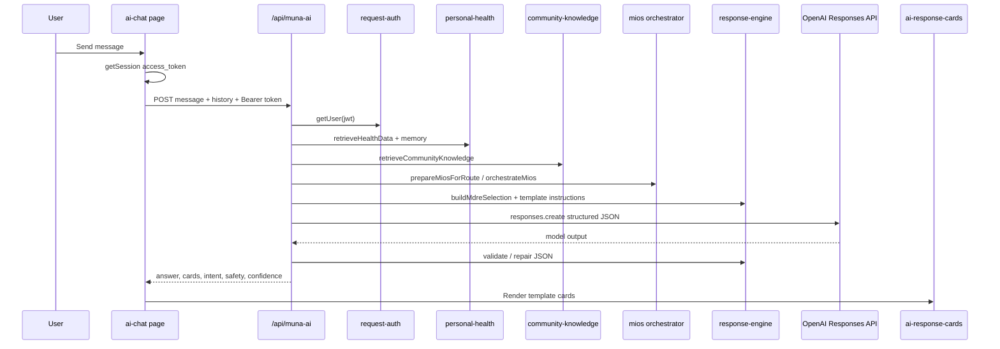

# MUNA IBS — AI Pipeline

**Last updated:** 14 July 2026  
**Related docs:** [Architecture](./MUNA_ARCHITECTURE.md) · [Security](./SECURITY.md) · [Database](./DATABASE.md)

This document describes the **actual** MUNA AI request path implemented in `src/app/api/muna-ai/route.ts` and supporting libraries. **MIE is not connected to this pipeline.**

---

## End-to-end flow

---

## Pipeline stages

### 1. User question

Client: `src/app/ai-chat/page.tsx` sends:

- `message` (required, max 2,000 chars)
- `history` (up to 8 prior turns)
- `Authorization: Bearer <access_token>` when signed in

### 2. Authentication

Server creates a Supabase client from the Bearer token and resolves the user ID. Health and memory loading require a valid user; without a token, personal data is empty and access notes explain the limitation.

### 3. Health-data retrieval

`retrieveHealthData()` loads recent rows from meals, symptoms, bowel movements, water, sleep, medications, trigger foods, weekly reports, and profile (`profiles` table when available).

`buildHealthSummary()` produces confidence labels (**Low / Moderate / Higher**) based on logging volume — **not** clinical certainty.

### 4. Personal memory

`resolvePersonalMemory()` builds or loads `user_memory.memory_json` — FODMAP classifications, observed associations with counts, habits, trends. Mapped to MIOS **personal_history** evidence.

### 5. Community retrieval

`retrieveCommunityKnowledge({ queryText })` uses the **service role** to query `community_knowledge`. Returns anecdotal snippets and may trigger **safety matched** themes (e.g. rectal bleeding, obstruction language).

Community content is labelled: *“Patient-reported community experience; anecdotal and not medical advice.”*

### 6. Safety screening

Layers:

- Route-level red-flag regex on user message
- Community safety themes
- MIOS `buildMiosSafetyResult()` → `safetyMatched`, `safetyAction`, `matchedThemes`
- Emergency intent detection in `detectIntent()`

When urgent safety applies, community non-safety evidence is filtered and MDRE forces the **emergency** template.

### 7. MIOS — MUNA Intelligence Operating System

`prepareMiosForRoute()` gathers evidence adapters:

| Source | Adapter | Live data? |
|--------|---------|------------|
| Personal | `adapters/personal.ts` | Yes (from memory + summary) |
| Experiment | `adapters/experiment.ts` | Yes (active/completed experiment) |
| Verified guidance | `adapters/verified.ts` | **No — returns `[]`** |
| Community | `adapters/community.ts` | Yes |
| Safety | `adapters/safety.ts` | Yes |

`orchestrateMios()` merges evidence, detects intent, builds `responsePlan`.

**Authority order** (`MIOS_EVIDENCE_AUTHORITY_ORDER`):

1. `safety`  
2. `verified_guidance`  
3. `personal_history`  
4. `experiment`  
5. `community`  
6. `general_knowledge`  

Conflicts favour higher-authority sources. Community cannot override safety or personal/clinical guidance.

**Internal-only:** `decisionSummary` is not returned to the client.

### 8. MDRE — MUNA Dynamic Response Engine

`buildMdreSelection()` chooses:

- **Intent** (from MIOS, forced to `emergency` when urgent)
- **Template** (see catalogue below)
- **Confidence** display rules
- **Association footer** visibility

`buildStructuredOutputInstructions()` tells the model to return JSON with **cards** matching the template.

### 9. OpenAI Responses API

- Model: `gpt-4.1-mini` (fallback `gpt-4o-mini` on model availability errors)
- `temperature`: 0.4  
- `max_output_tokens`: 900  
- History truncated in prompt construction (message slices, ~700 chars per turn)

System instructions include MUNA safety rules, health context, memory context, MIOS reasoning context, and MDRE JSON schema.

### 10. Structured cards → client rendering

Response JSON fields exposed to client:

- `answer`, `intent`, `template`, `safetyStatus`, `confidence`, `confidenceLabel`
- `evidenceSummary`, `missingEvidence`, `suggestedFollowUps`
- `cards`, `showConfidenceBadge`, `showAssociationFooter`

Parsing: `src/components/ai-chat/parse-ai-response.ts`  
Rendering: `src/components/ai-chat/ai-response-cards.tsx`

---

## Intent catalogue (MIOS)

| Intent | Typical triggers |
|--------|------------------|
| `emergency` | Blood in stool, severe pain, obstruction language, overdose, etc. |
| `experiment` | “experiment”, “trial”, reintroduction |
| `medication` | Dose, tablets, stop/skip medication (high precedence) |
| `food` | “can I eat”, FODMAP foods, triggers |
| `bowel_habits` | Bristol, constipation, diarrhoea |
| `symptoms` | Bloating, pain, flare |
| `emotional_support` | Hopeless, anxious, panic |
| `education` | “what is IBS”, FODMAP explainers |
| `lifestyle` | Sleep, stress, hydration, brain-gut |
| `general` | Default |

Precedence: emergency → experiment → medication → food/bowel/symptoms → emotional → education → lifestyle → general.

---

## MDRE template catalogue

| Template | Use |
|----------|-----|
| `emergency` | Urgent safety — overrides all |
| `medication` | Medication questions — no dosing |
| `food` | Diet / trigger questions |
| `symptoms` | Symptom discussion |
| `experiment` | Experiment results |
| `emotional_support` | Distress / anxiety |
| `education` | General IBS education |
| `bowel_habits` | Stool / Bristol patterns |
| `lifestyle` | Sleep, stress, habits |
| `general` | Fallback |

---

## Emergency override

`mustUseEmergencyTemplate()` returns true when:

- `urgentSafety` flag from route preparation, **or**
- MIOS `safetyStatus` is `matched` / `critical`, **or**
- Intent is `emergency`

Association footers and non-safety reassurance are suppressed.

---

## Evidence-source separation

| Source | Role | Clinical weight |
|--------|------|-----------------|
| Safety | Block or escalate | Highest |
| Verified guidance | Official summaries | High (when wired) |
| Personal history | User’s logs | Personal only |
| Experiment | User’s trial check-ins | Personal only |
| Community | Anecdotal patterns | Low — never prevalence claims |
| General knowledge | Model + prompt education | Generic |

---

## Confidence labels

**MIOS / MDRE:** `higher`, `moderate`, `limited`, `unavailable`  
**Display (when badge shown):** mapped via `mapMiosConfidenceToDisplayLabel()` — reflects evidence strength and logging, **not** medical certainty.

Personal Memory also uses **Low / Moderate / Higher** for data volume (`user_memory.confidence_level`).

---

## Prohibited claims (MIOS defaults)

- Diagnosis  
- Causation / proven triggers  
- Treatment guarantees  
- Community prevalence statistics  
- Medication dosing or stopping prescribed medication  
- Invented personal information  

Enforced through MIOS response plan, system prompt, and MDRE templates — not through a separate post-filter model.

---

## Fallback behaviour

| Condition | Behaviour |
|-----------|-------------|
| MIOS preparation throws | Legacy community block may be used; `usedMios: false` |
| Invalid JSON from model | One repair pass with `buildJsonRepairInstructions`; then `buildFallbackStructuredOutput` |
| Empty answer | HTTP 502 |
| OpenAI quota / rate limit | Error message propagated |
| No auth token | General guidance; personal sections empty |

---

## Token-control rules (current)

- Max output tokens: **900**
- Conversation history: last **8** turns in API body; further truncated in prompt
- Community records capped (`MIOS_COMMUNITY_LIMIT = 3`)
- Verified guidance cap defined (`MIOS_VERIFIED_GUIDANCE_LIMIT = 2`) when wired
- Message length cap: **2,000** characters

No embedding retrieval or RAG vector index in v1.

---

## Verified-guidance limitation

`fetchVerifiedGuidanceEvidenceForMios()` in `src/lib/mios/adapters/verified.ts` explicitly returns an **empty array**. The `verified_scientific_guidance` table and JSON dataset exist, but **approved records are not yet loaded into live AI requests**.

Only rows with `review_status = 'approved'` and `is_active = true` should be used when retrieval is implemented.

---

## MIE — not connected to MUNA AI

The **MUNA Insight Engine** (`generateMunaInsights()`, `/api/insights`) runs separately:

- Deterministic, no OpenAI  
- Persists to `muna_insights`  
- Not injected into `/api/muna-ai` prompts today  

**MTI** (`generateTimelineEvents()`) converts MIE output to timeline events in library code only — also not in the AI pipeline.

Future integration must preserve authority order and avoid exposing raw logs or internal summaries.

---

## Related API routes (non-chat)

| Route | AI? | Purpose |
|-------|-----|---------|
| `/api/daily-brief` | No | Rule-based daily brief |
| `/api/insights` | No | MIE generation + storage |
| `/api/experiments` | No | Experiment CRUD + evaluation |

See [MUNA_ARCHITECTURE.md](./MUNA_ARCHITECTURE.md).
