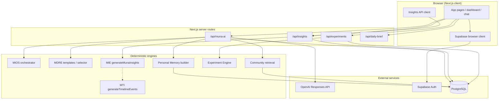

# MUNA IBS — System Architecture (v1.0)

**Last updated:** 14 July 2026  
**Status:** Pre-beta development  
**Related docs:** [Roadmap](./MUNA_ROADMAP.md) · [Database](./DATABASE.md) · [AI Pipeline](./AI_PIPELINE.md) · [Security](./SECURITY.md) · [Version History](./VERSION_HISTORY.md)

---

## 1. Product purpose

**MUNA IBS** is an educational brain–gut health companion for people living with irritable bowel syndrome (IBS). It helps users log food, symptoms, bowel habits, sleep, hydration, stress, and experiments; view dashboard summaries; and ask questions through MUNA AI.

MUNA is **not** a diagnostic system, clinical decision support tool, or substitute for qualified healthcare professionals. It supports pattern awareness, self-tracking, and evidence-informed education.

---

## 2. Technology stack

| Layer | Technology |
|-------|------------|
| Frontend | Next.js 16 (App Router), React 19, TypeScript, Tailwind CSS |
| Backend / DB | Supabase (PostgreSQL, Auth) |
| AI | OpenAI Responses API (`gpt-4.1-mini`, fallback `gpt-4o-mini`) |
| Deployment | Vercel (documented in project context) |

Package version: `0.1.0` (`package.json`).

---

## 3. Major application modules

| Module | Location | Status |
|--------|----------|--------|
| Authentication | `src/lib/supabase.ts`, `src/app/login` | Implemented |
| Personal health logging | `src/app/add-meal`, `add-symptoms`, `water`, `sleep`, `bowel-movement`, etc. | Implemented |
| Dashboard | `src/app/dashboard` | Implemented (includes temporary MIE test panel) |
| Personal Memory | `src/lib/personal-health.ts` | Implemented |
| Experiment Engine | `src/lib/experiment-engine.ts`, `src/app/experiment`, `/api/experiments` | Implemented |
| Food Intelligence (v1) | `src/lib/food-intelligence.ts` | Implemented (deterministic, in-app) |
| Community Intelligence | `src/lib/community-knowledge/` | Implemented (server retrieval) |
| Verified Guidance framework | `src/lib/verified-guidance/`, migration | Partially implemented (dataset + schema; live retrieval not wired) |
| **MIOS** — MUNA Intelligence Operating System | `src/lib/mios/` | Implemented (v1) |
| **MDRE** — MUNA Dynamic Response Engine | `src/lib/response-engine/` | Implemented (v1) |
| **MIE** — MUNA Insight Engine | `src/lib/insights/` | Phase A + B implemented; not connected to AI or dashboard insights UI |
| **MTI** — MUNA Timeline Intelligence | `src/lib/timeline/` | Phase A implemented (in-memory + storage helpers); no API route yet |
| Daily Brief | `src/lib/daily-brief.ts`, `/api/daily-brief` | Implemented |

---

## 4. Architecture diagram



---

## 5. Personal health logging architecture

Users log data through Next.js pages and shared components (e.g. `SaveEntryButton`). The browser Supabase client inserts rows into user-scoped tables with RLS (`user_id = auth.uid()`).

**Primary tables:** `meals`, `symptoms`, `bowel_movements`, `water_logs`, `sleep_logs`, `medication_reminders`, `trigger_foods`, `weekly_reports`, `users` (profile extension).

**Server-side aggregation:** `retrieveHealthData()` in `src/lib/personal-health.ts` loads recent rows for MUNA AI and daily brief using a Bearer-authenticated Supabase client.

**Derived logic (not stored as diagnoses):**

- Gut score / flare risk: `src/lib/risk.ts`, dashboard
- Food patterns: `src/lib/food-intelligence.ts`
- Personal Memory JSON: built from logs in `personal-health.ts` and persisted to `user_memory`

See [DATABASE.md](./DATABASE.md) for table details.

---

## 6. Supabase architecture

- **Auth:** Supabase Auth (`auth.users`); session stored in browser localStorage via `@supabase/supabase-js`.
- **Anon key:** Used in browser and server routes for user-scoped reads/writes under RLS.
- **Service role:** Used only on the server (`src/lib/supabase/admin.ts`) for community retrieval, insight/event writes, and other privileged operations. Never exposed to the client.
- **Migrations:** `supabase/migrations/` (incremental) plus baseline `supabase/schema.sql`.

---

## 7. Authentication flow

MUNA does **not** use cookie-based Supabase SSR in the current codebase. API routes authenticate via **Authorization Bearer token**:

1. Browser calls `supabase.auth.getSession()` and reads `access_token`.
2. Client sends `Authorization: Bearer <token>` to `/api/muna-ai`, `/api/insights`, `/api/experiments`, `/api/daily-brief`.
3. Server uses `authenticateSupabaseRequest()` / `createSupabaseForRequest()` (`src/lib/supabase/request-auth.ts`).
4. Server validates JWT with `supabase.auth.getUser(accessToken)`.
5. User-scoped Supabase client performs RLS-protected queries.

Unauthenticated `/api/muna-ai` requests still receive a response (general mode). `/api/insights` and `/api/experiments` return **401** without a valid token.

Details: [SECURITY.md](./SECURITY.md).

---

## 8. Personal Memory

**Purpose:** Compress a user’s recent logs into a structured, AI-readable profile (FODMAP classifications, observed associations, habits, trends).

**Flow:**

1. Health rows loaded server-side.
2. `buildPersonalMemoryJson()` derives categories with counts and limitations.
3. Stored in `user_memory.memory_json` (user read/write via RLS).
4. Injected into MUNA AI context; mapped to MIOS personal evidence.

Personal Memory does **not** upgrade associations to confirmed triggers or diagnoses.

---

## 9. Experiment Engine

**Purpose:** Structured 3/5/7-day self-observation trials with daily check-ins.

**Components:**

- Deterministic evaluation: `src/lib/experiment-engine.ts`
- Safety validation: `src/lib/experiment-safety.ts`
- Progress: `src/lib/experiment-progress.ts`
- API: `src/app/api/experiments/route.ts`
- UI: `src/app/experiment/page.tsx`

Experiments are educational self-tracking only. Red-flag language can block evaluation.

---

## 10. Community Intelligence

**Purpose:** Retrieve curated, anonymised community knowledge for AI context and safety triage.

**Storage:** `community_knowledge` table (no client policies; server-only read via service role).

**Retrieval:** `src/lib/community-knowledge/retrieval.ts` — keyword/theme matching, safety themes, max 5 records, labelled as anecdotal.

**MIOS integration:** Community evidence has **lower authority** than safety, verified guidance, personal history, and experiments.

---

## 11. Verified Guidance framework

**Purpose:** Store official-source IBS guidance summaries with review workflow (`draft` → `reviewed` → `approved`).

**Storage:** `verified_scientific_guidance` table (server-only; RLS enabled, no client policies).

**Dataset tooling:** `src/lib/verified-guidance/`, `data/guidance/MUNA_Verified_IBS_Guidance_v1.json`.

**Current limitation:** `fetchVerifiedGuidanceEvidenceForMios()` returns an empty array — approved guidance is **not** yet retrieved in live AI requests. See [AI_PIPELINE.md](./AI_PIPELINE.md).

---

## 12. MIOS — MUNA Intelligence Operating System

**Purpose:** Deterministic pre-AI orchestration — intent detection, evidence merge, safety status, response plan.

**Entry:** `orchestrateMios()` in `src/lib/mios/orchestrator.ts`  
**Route wrapper:** `prepareMiosForRoute()` in `src/lib/mios/prepare-orchestration.ts`

**Evidence sources (authority order):**

1. Safety  
2. Verified guidance  
3. Personal history  
4. Experiment  
5. Community  
6. General knowledge  

**Outputs used by MDRE:** intent, safety status, confidence, evidence summary, follow-ups. Internal `decisionSummary` is **not** exposed to clients.

---

## 13. MDRE — MUNA Dynamic Response Engine

**Purpose:** Map MIOS output to response templates and structured JSON cards for the chat UI.

**Key files:** `src/lib/response-engine/selector.ts`, `templates.ts`, `types.ts`

**Templates:** `emergency`, `medication`, `food`, `symptoms`, `experiment`, `emotional_support`, `education`, `bowel_habits`, `lifestyle`, `general`

**Emergency override:** `mustUseEmergencyTemplate()` forces the emergency template when safety is matched/critical.

---

## 14. MIE — MUNA Insight Engine

**Phase A (deterministic):** Domain generators (`food`, `hydration`, `sleep`, `stress`, `bowel`, `experiment`, `overall`) → `generateMunaInsights()` in `src/lib/insights/orchestrator.ts`. In-memory only; no OpenAI.

**Phase B (storage + API):**

- Table: `muna_insights`
- API: `GET/POST /api/insights` (`src/app/api/insights/route.ts`)
- Client helper: `src/lib/insights/api-client.ts`
- Writes via service role; reads via user JWT + RLS

**Not connected:** MUNA AI, dashboard insight cards (except temporary dev test button), MTI auto-generation on POST.

---

## 15. MTI — MUNA Timeline Intelligence

**Phase A (current):** Converts MIE insights into timeline events (`generateTimelineEvents()` in `src/lib/timeline/orchestrator.ts`).

**Storage:** `muna_events` migration + `src/lib/timeline/storage.ts` (server-only writes).

**Not wired:** No `/api/timeline` route; not invoked from `/api/insights`; no dashboard timeline UI.

---

## 16. Client / server boundaries

| Concern | Client | Server |
|---------|--------|--------|
| Raw health log CRUD | Yes (RLS) | Via user JWT in routes |
| OpenAI calls | Never | `/api/muna-ai` only |
| Service role | Never | Insights/events save, community read |
| MIOS / MDRE / MIE / MTI logic | Never | Library code in API routes or future jobs |
| Personal Memory upsert | Indirect via AI route | `muna-ai` route after response |
| Community / verified DB read | Never | Service role |

---

## 17. Current data flows

### AI chat

User message → Bearer auth → health data + memory → community retrieval → MIOS → MDRE template → OpenAI structured JSON → cards rendered in `src/app/ai-chat`.

### Insight generation

Dashboard test button (or API client) → Bearer auth → `POST /api/insights` → fetch logs → `generateMunaInsights()` → persist to `muna_insights` → return user-safe insight objects.

### Experiments

Experiment page → Bearer auth → `/api/experiments` → CRUD on `experiments` / `experiment_checkins` → deterministic evaluation.

---

## 18. Folder structure (high level)

```
src/
  app/                    # Next.js pages and API routes
    api/
      muna-ai/            # AI chat backend
      insights/           # MIE Phase B API
      experiments/        # Experiment API
      daily-brief/        # Daily brief API
    dashboard/            # Main hub (+ temp insight test panel)
    ai-chat/              # Chat UI
  components/             # Shared UI
  lib/
    mios/                 # MIOS v1
    response-engine/      # MDRE v1
    insights/             # MIE Phase A + B
    timeline/             # MTI Phase A
    community-knowledge/  # Community retrieval
    verified-guidance/    # Verified guidance types/validation
    personal-health.ts    # Health retrieval + memory
    experiment-engine.ts
    supabase/             # request-auth, admin service client
supabase/
  schema.sql              # Baseline health tables
  migrations/             # user_memory, experiments, community, verified, insights, events
data/
  guidance/               # Verified guidance JSON source
docs/                     # Architecture documentation (this set)
```

---

## 19. Implemented vs planned

| Capability | Status |
|------------|--------|
| Auth + health logging | Implemented |
| Dashboard + analytics pages | Implemented |
| MUNA AI + MIOS + MDRE | Implemented |
| Community knowledge in AI | Implemented |
| Verified guidance in AI | **Not wired** (retrieval stub) |
| MIE generation + API | Implemented |
| MIE in dashboard / AI | **Planned** |
| MTI Phase A library | Implemented |
| MTI API + UI | **Planned** |
| Knowledge Memory | **Planned** |
| Clinical timeline / weekly digest | **Planned** |
| Mobile store release | **Planned** |

Roadmap detail: [MUNA_ROADMAP.md](./MUNA_ROADMAP.md).
